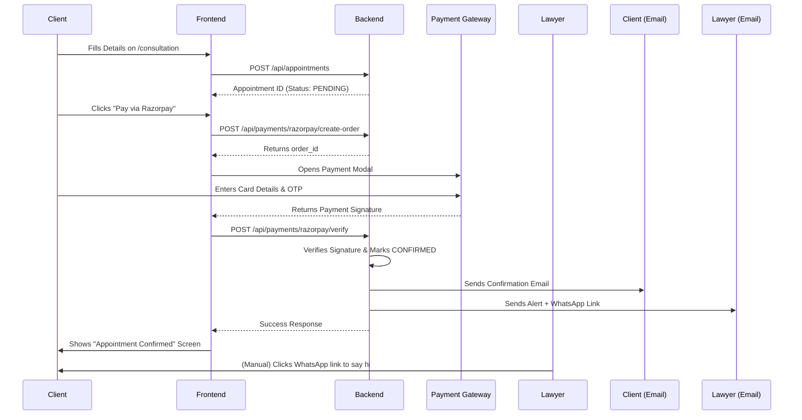

# Local Testing, Deployment, & Process Flow Guide

This document outlines how to test the application locally, deploy it for free using modern hosting providers, and test the end-to-end booking process.

---

## 1. Local Testing & Verification

To verify that both the frontend and backend are working together locally, follow these steps:

### A. Start the Backend
1. Open a terminal and navigate to the backend directory:
   `cd backend`
2. Ensure your PostgreSQL database is running and `DATABASE_URL` is correct in `backend/.env`.
3. Start the Express server:
   `npm run dev`
4. Wait until you see: `🚀 Server running on http://localhost:5000`

### B. Start the Frontend
1. Open a **new** terminal and navigate to the root directory:
   `cd c:\Github\LawyerWebsite`
2. Ensure your `src/data/siteSettings.ts` has `BACKEND_URL` pointing to `http://localhost:5000`.
3. Start the Next.js frontend:
   `npm run dev`
4. The website will be available at `http://localhost:3000`

### C. Verify the Integration
1. Go to `http://localhost:3000` in your browser.
2. Scroll to the new **Areas of Practice** section and click "Book →" on any service.
3. You should be taken to the `/consultation` page with the service pre-selected.
4. Fill out the form details and submit. If it proceeds to the Payment Step without errors, the backend API connection is working perfectly.

---

## 2. Free Deployment Architecture

You can deploy this full-stack application completely for free using the following stack:

- **Frontend:** Vercel (Free tier)
- **Backend:** Render (Free tier Web Service)
- **Database:** Supabase (Free tier PostgreSQL)

### Step 1: Set up the Database (Supabase)
1. Go to [Supabase](https://supabase.com/) and create a free account.
2. Create a new Project. Wait for the database to provision.
3. Go to **Project Settings > Database** and copy the **Connection string** (URI).
4. Save this URI; you will use it as your `DATABASE_URL` for the backend.
5. Apply the schema from your local machine to Supabase:
   `cd backend`
   `DATABASE_URL="your-supabase-url" npx prisma db push`
   `DATABASE_URL="your-supabase-url" npm run prisma:seed`

### Step 2: Deploy Backend (Render)
1. Push your code to a GitHub repository.
2. Go to [Render](https://render.com/) and create a free account.
3. Click **New > Web Service** and connect your GitHub repository.
4. **Configuration:**
   - **Root Directory:** `backend`
   - **Build Command:** `npm install && npm run build && npx prisma generate`
   - **Start Command:** `npm start`
5. **Environment Variables (Add these in Render dashboard):**
   - `DATABASE_URL`: (Your Supabase connection string)
   - `NODE_ENV`: `production`
   - `PORT`: `10000` (Render handles this automatically usually)
   - `JWT_SECRET`, `EMAIL_HOST`, `RAZORPAY_KEY_ID`, etc. (Copy all relevant secrets from your `.env`)
   - *Note: Remember to set `FRONTEND_URL` to your future Vercel URL.*
6. Click **Deploy**. Once live, copy the Render URL (e.g., `https://lawyer-backend.onrender.com`).

### Step 3: Deploy Frontend (Vercel)
1. Go to [Vercel](https://vercel.com/) and create a free account.
2. Click **Add New > Project** and import your GitHub repository.
3. **Configuration:**
   - **Framework Preset:** Next.js
   - **Root Directory:** `./` (Leave as default)
4. **Environment Variables:**
   - `NEXT_PUBLIC_BACKEND_URL`: (Your Render URL, e.g., `https://lawyer-backend.onrender.com`)
5. Click **Deploy**. Vercel will build and host your Next.js frontend globally.

---

## 3. End-to-End Process Flow (How it Works)

This is the exact sequence of events when a client books a consultation. You can follow these steps to test the entire flow once deployed (or locally).

> [!TIP]
> **Testing Payments:** If using Razorpay Test Mode, use the test card `4111 1111 1111 1111` with any future expiry date and any CVV. The test OTP is `123456`.

### Flow Diagram

### 1. The Booking Phase
- The user lands on the website, browses the **Services** section, and selects a service (e.g., Family Law).
- They are redirected to `/consultation?service=family-law`.
- They fill out their Name, Email, Phone, and a brief description of the matter, then check the legal disclaimer.
- Upon clicking "Continue to Payment", the frontend sends the data to the backend. The backend creates an appointment with a `PENDING_PAYMENT` status in the database.

### 2. The Payment Phase
- The user sees a summary of their booking and chooses between **Razorpay** and **PhonePe**.
- **If Razorpay:** The backend generates an Order ID, and a secure Razorpay popup opens. The user enters their payment details.
- **If PhonePe:** The user is redirected to the PhonePe checkout page to scan a QR code or use UPI.

### 3. The Verification Phase
- Once payment is successful, the gateway sends a cryptographic signature back to the server (either via frontend callback for Razorpay, or a server-to-server webhook for PhonePe).
- The backend verifies this signature using the secret keys to ensure the payment wasn't forged.
- The appointment status in the database changes from `PENDING_PAYMENT` to `CONFIRMED`.

### 4. The Notification Phase
- **For the Client:** The backend sends a beautifully formatted HTML email confirming the appointment, containing the amount paid and their unique Reference Number (e.g., `RA-20260823-XYZ`).
- **For the Lawyer:** The backend sends an alert email containing the client's details and a special WhatsApp "click-to-chat" link.
- The client sees a Success screen on the frontend and is given the option to message the lawyer directly on WhatsApp.

### 5. Follow-Up
- The lawyer checks their email, clicks the WhatsApp link, and a chat window opens with a pre-filled greeting: *"Hi [Client Name], this is Raja Agrawal. Your appointment for Family Law has been confirmed..."*
- They agree on the exact meeting time over WhatsApp.
